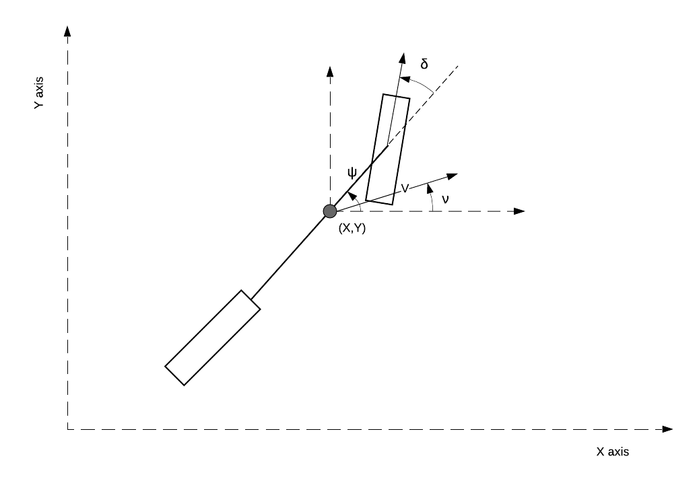

# PID Control Project

The aim of this project is to implement a PID ( Propotional Integral and Derivative Controller) to keep a vehicle in the center of the road.This writeup discusses how each point in the project requirements are considered in the project implementation and also how the parameters of the controller is tuned.

### The follwoing steps are involved in designing the PID controller.
1. Identification of System Model
2. Controller Design

## System Identification
In order to design a controller it is important to understand the behaviour of the system. The following picture shows the overview of the control loop for controlling the steering of the vehicle.

The PID contorller receives from the simulator the cross track error, which is the distance of the vehicle from the center of the road. Then it should calculate the steering command value and sends back to the simulator which is applied to the car. In order to control the car its behaviour has to be understood i.e. how steering value(input variable) affects the postion of the car(output variable). Ideally a mathematical model to describe the motion of vehicle would be useful to design a controller. There are many ways to get such a mathematical model.One method is to use physical equations to describe the vehicle motion. Another method is to make experiments on the vehicle and estimate the model based on the input and output data which is called black box system identification which is a form of supervised learning. One of the common model used for describing the lateral dynamics of vehicle motion is called bicycle model, which reduces the wheels of car into two front and rear wheel. In this project a simplified verision of bicycle model is used to model the vehicle. The following picture shows the properties of the vehicle motion.

The main assumption of the bicycle model is that the magnitude of the vehicle velocity is constant and the bicycle model can be used to calculate the vehicle position for a given steering angle. In this project instead of indentifying the parameters of physical equations of the bicycle model experimental data is used to estimate the transfer function between steering angle and the vehicle position. This project uses the same simulator used in the term - 1 project "Behaviour Cloning". The term-1 was modified to carry out the necassary experiments for estimating the transfer function. The simulator was modified to log the input and output data. The following table shows the input and output variables logged from the simulator. 

|Name|Type|Symbol|
|:-|:-|:-|
|Steering Angle| Input Variable| $\delta$|
|Speed| Output Variable (Considered constant - controlled by another PID  )| $\lvert V \rvert$|
|Position in X axis | Output Variable | X |
|Position in Y axis | Output Variable | Y |
|Yaw Angle(w.r.t X axis)| Output Variable | $\psi$|
|Angle of Velocity vector (w.r.t X axis)| Output Variable ( derived from X and Y)| $\nu$|
|Time||t|

When a vehicle is moving at a constant velocity giving a steering wheel angle causes the vehicle to yaw and change the direction of vehicle velocity. The position of the vehicle can be determined from the direction and magnitude of the velocity vector using the following equations.

$$\frac{dX}{dt} = |V|\cos\nu$$

$$\frac{dY}{dt} = |V|\sin\nu$$

Experiments are carried out to find the transfer function between the steering angle $\delta$ and the direction of velocity $\nu$ and then the above equations are used to calulate the position of the vehicle.

The experiments are done by driving the car in a plane at constanct speed and by giving sinusoidal signals of varying frequency(0 to 4 Hz) to the steering value and measuring the position and yaw of the vehicle in response. The following picture shows the experimental data. The car was excited with input steering value of varying frequency to basically determine the frequency response of the car to the steering input. It can be seen from the data that at low frequencies the system has high gain. When the input frequncy is higher the car doesn't respond quicky and so the gain reduces as the frequency increases.

MATLAB - System Idendification toolbox is used to estimate the transfer function based on the above shown data. Similar to supervised learning even here a separate validation data set is used. The validation set was generated by driving the car manually around the lake track in simulator. The system identificatio toolbox is albe to identify a transfer function between steering value and vehicle velocity direction with 75% accuracy. The identified transfer function contains two poles and one zero. It is possible to model the system more accurately but this is sufficient to tune the controller. The transfer function between the steering value(0 -1) and the direction of the vehicle velocity at a constant speed of 30 mph is shown in the equation below.

$$G_{Steer}(s) =\frac{-1.8523 (s+0.2039)}{(s+0.2367) (s+0.0001942)} $$

The picture below compares the response of the model against the validation data from the simulator for the same steering angle input.

## Controller Design

Once the plant model is known it is easier to design a PID controller. The transfer function between steering ratio and velocity vector direction is already identified using this the vehicle position can be determined. We can assume that the vehicle is travelling parallel to either the X axis or Y axis and the PID controller should keep the vehicle along the chosen axis and also change the position based on the reference position. If it is assumed the vehicle is travelling along X or Y axis then the equation to determine the position can be linearised to $\frac{dX}{dt} = |V|\nu$ or $\frac{dY}{dt} = |V|\nu$. The transfer function between the vehicle velocity direction and vehicle position becomes $G_{Position} = \frac{|V|}{s}$.

The picture below shows the control loop with the linearised plant model for the vehicle driving parallel to X or Y axis.

The total plant transfer function between steering ratio and vehicle position is given by

$$G_{Vehicle}(s) =\frac{-1.8523*13.4 (s+0.2039)}{s(s+0.2367)(s+0.0001942)} $$

It can be seen that in the $G_{Position}$ has increased the open loop gain and added an integrator to the open loop plant model. When designing a closed loop controller the most important thing to be considered is the stability of the control loop. The stablity of linear time invariant system (LTI) is stable when the response of the system for a bounded input signal is bounded output(BIBO). A LTI system is BIBO stable if all the roots of the system lie on the left of the s-plane. For a system with open loop transfer function $G_o$ it has a closed loop transfer function $\frac{G_o}{1+G_o}$. The roots of the closed loop system is given by the roots of the characteristic equation $1 + G_o$.

The PID controller is designed by technique called root locus method. Root locus method is a technique to trace the root location of the closed loop system for given open loop transfer function by varying the open loop system gain. With this method the controller gain can be chosen such a way that the roots of the closed loop system are placed in desired location in s-plane ensure stability and a desired transient response. In case of the PID controllers the propotional gain Kp determines the open loop system gain, it determines the location of closed loop poles on the root loci but it does not affect the shape of root loci. Whereas the integral Ki and derivative gain Kd add a pole and zero to the open loop transfer function thus they alter the shape of the root loci. Usually when desiging a PID controller the effects of each component is analyzed indiually and tuned.

In case of our system the system gain is negative because a positive steering value makes the vehicle turn clockwise(right) but the vehicle velocity vector direction and yaw have anticlockwise direction as positive. This implies if there is a positive cross track error the controller should give negative steering angle to compensate i.e. the contoller gain Kp should be less than 0 to make the control loop stable. The following picture shows the root locus of our system with positive gain it can be seen that one of the loci goes in the right side of the s-plane making the system unstable for any gain Kp>0.

Our system already has a pole at s = 0 and one pole very close to s = 0 , adding another integrating term to the controller makes the root loci to shift to right side of the s-plane making the system unstable. So our system can use only either a P controller or a PD controller. The integrating term in the PID controller is usually used to correct the steady state error, in this case a small bias is tolerable. So the integrating term is not needed. The following picture shows the root locus of the system with a PI controller.

The transfer function of a PD controller is given by 

$$PD(s) = K_p + K_d.s = K_p(1 +\frac {K_d.s}{K_p}) $$

The derivative term in the PD controller adds a zero to the open loop transfer function at a location $s = \frac{K_p}{K_d} $. From the above equation it can be seen that the gain K_p determines the overall gain of the system and the ratio $\frac{K_p}{K_d}$ determines the location of the open loop zero. The following picture shows the root locus of the system for different values of the gain $K_d$ for the same value of gain $K_p$ and also the step response of closed loop system.

$$K_p = -0.1, K_d = -0.125$$

$$K_p = -0.1, K_d = -0.1$$

It can be seen from the above pictures that when the zero of the PD controller gets closer to origin the damping ratio of the complex poles increases. That is when the gain $K_d$ reduced from -0.1 to -0.125 the damping ratio of the system increases from 0.82 to 0.92, this effect is also noticable in the overshoot of the step response. Usually for the complex poles the damping ratio is kept between 0.7 to 1 to acheive a good transient response. The following picture shows the root location for $K_p = -0.2, K_d = -0.1$

Eventhough the decreasing both the gains $K_p, K_d$ will improves the transient reponse of the system theoritically there are practical problems when the magnitude of the controller gains are increased. In case of the gain $K_d$ it has to be noted that the derivative of the error signal calculated by a computer is always an approximation since all computer operated by finite sample time, larger the sample time lesser the accuracy of the derivative. Also it has to be noted that in real world the measurements taken by sensors have noise and the derivative term in the PID is sensitive to noise. So having a high derivative gain will make the system unstable due to the noise. In order to avoid this usually the derivative term is included with a low pass pass filter. But for this project a low pass filter is not necassary because the project works only in the simulator which does not send a noisy measurement.  In case of propotional gain increasing its magnitude causes a large effort for the actuators, which are usually constrained too. For example the simulator accepts steering value between -1 to 1, if the gain value of $K_p$ is set to -1 then the control will give a steering value of 1 for a error value of 1m. So considering the practical contrains the value of $K_p, K_d$ are set to -0.1 and -0.1 respectively. For these value of controller gains the PID controller is able to drive the vehicle around the lake track for speeds upto 70 mph. It has to be noted that there is large range of values of controller gains where the system is stable.

It should be noted that in the starter code of the project there was no sample time used in the calculation of the derivative and integrating term. The sample time was implicitly included in the controller gain but in the imnplementation of this project a sample time of 0.02s is used which was found from the simulator.

